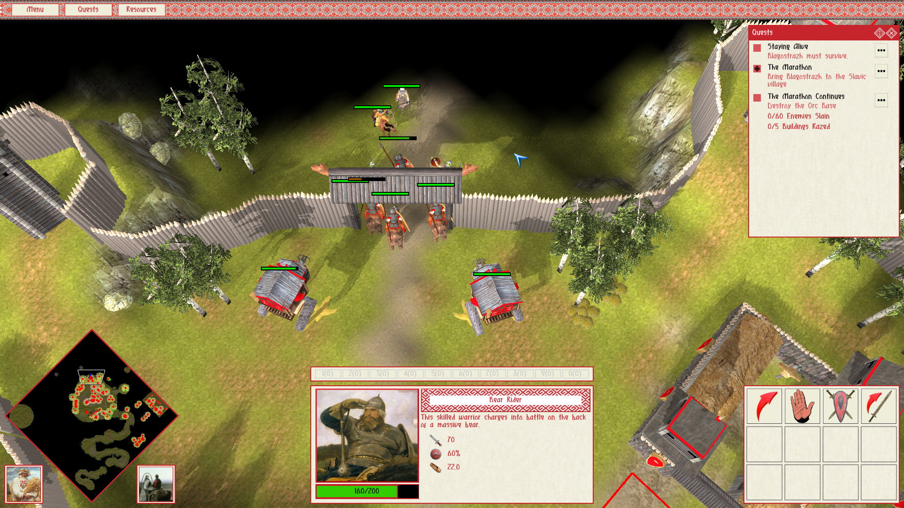
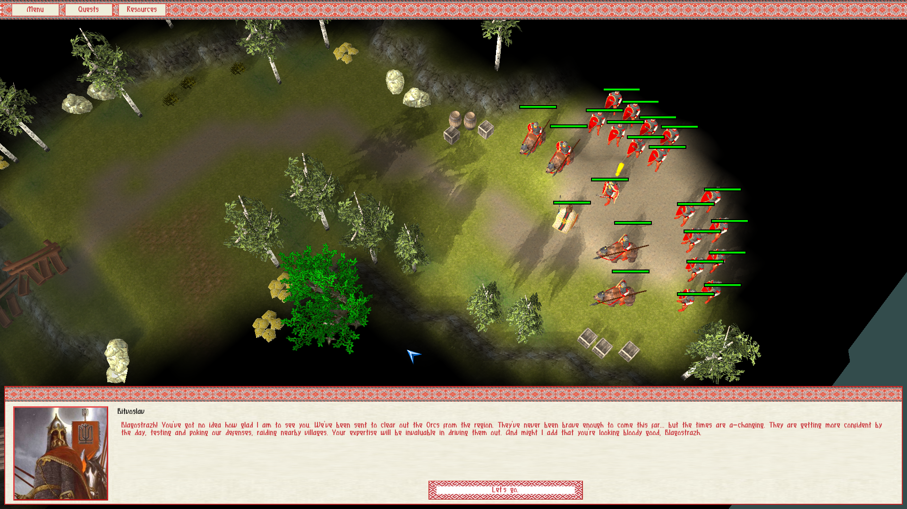
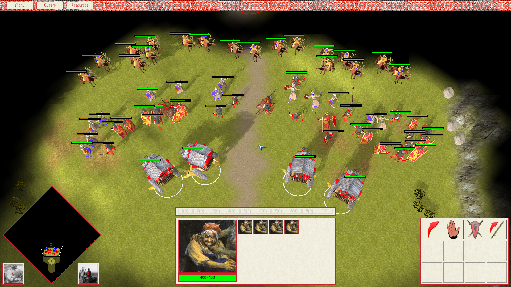
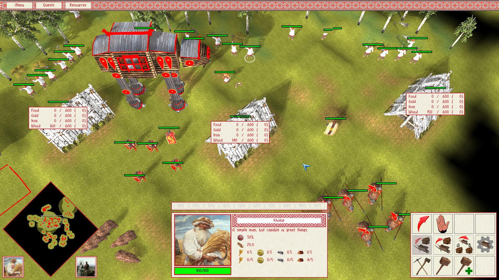
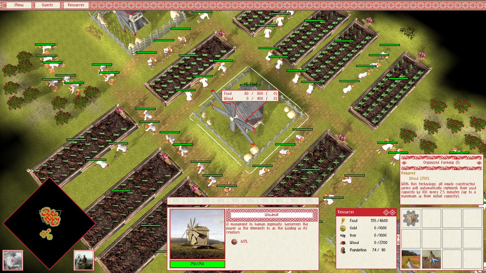
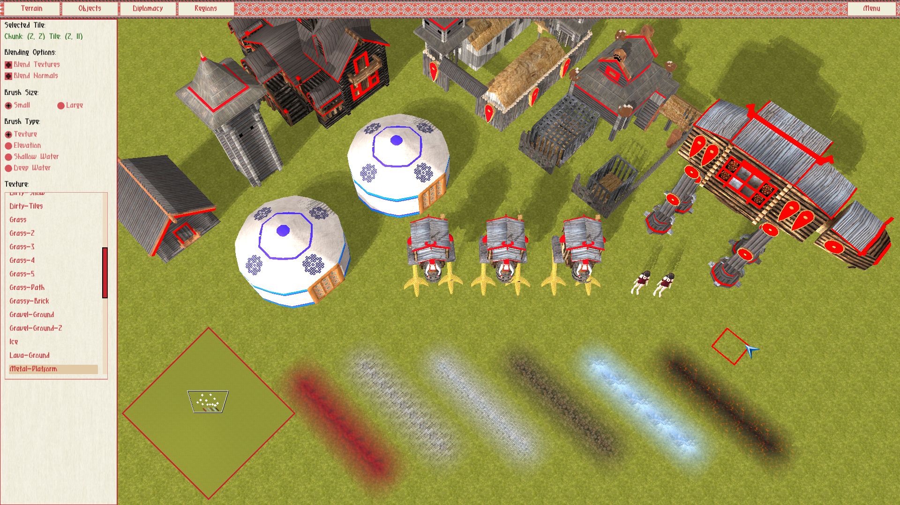

##  ##

Permafrost Engine is an OpenGL 3.3 Real Time Strategy game engine written in C. 
It is made in the image of old classics, but incorporating some modern ideas.

## Engine Showcase ##

EVERGLORY is the flagship game developed using Permafrost Engine. 

Download the free (or donate what-you-want) demo on [itch.io](https://spb.itch.io/everglory) or on [Steam](https://store.steampowered.com/app/1309720/EVERGLORY/). With the demo you also get access to all the scripts and assets powering the gameplay to learn from and modify as you wish.

## Engine Summary ##

* OpenGL 3.3 programmable pipeline (more modern extensions used where available)
* Custom ASCII model format with Blender export script
* Skeletal animation with GPU skinning
* Phong reflection model with materials
* Directional light shadow mapping
* Batched rendering with dynamic batches
* Ringbuffer-based streaming of data to GPU
* RTS camera, FPS camera
* Rendering of tile-based map parsed from ASCII file
* Water rendering (including reflection, refraction, soft edge effects)
* Export/Import of game entites to/from ASCII files
* Engine internals exposed to Python 2.7 for scripting
* Event system
* UI framework (Nuklear-based)
* Efficient raycasting
* Map/Scene editor
* Pause/Resume system
* Fast rendering of huge maps
* Map navigation graph/grid generation
* Implementation of 'boids' steering/flocking behaviours
* Hierarchial flow field pathfinding
* Handling of dynamic obstacles in pathfinding
* Dynamic collision avoidance of multiple entities using Hybrid Reciprocal Velocity Obstacles and the ClearPath algorithm
* Pathfinding of different kinds/sizes of units (using "navigation layers")
* Efficient spatial indexing using a quadtree
* Efficient real-time tracking of entity membership to dynamic spatial regions
* Audio system supporting positional effects and multiple channels of global effects
* RTS minimap
* RTS-style unit selection
* RTS unit combat system
* RTS fog-of-war system
* RTS base-building mechanics
* RTS resource gathering (and transporting) mechanics
* Ranged combat using an efficient projectile physics simulation
* Support for different resolutions and aspect ratios
* Configurable graphics settings
* Serialization and deserialization of the entire Python interpreter state
* Saving and restoring of any engine session, including all Python-defined state
* Multithreaded: simulation and rendering in a 2-stage pipeline
* Advanced debug visualizations and profiling instrumentatation
* Fiber system for putting work in lightweight tasks that are scheduled in userspace
* Fiber-backed Python tasks, allowing cooperative multitasking logic in Python
* Cross-platform (Linux and Windows)
* Windows launcher to automatically capture a minidump and stdout, stderr logs on application error

## Dependencies ##

* SDL2 2.0.10
* GLEW 2.1.0
* python 2.7.17
* openal-soft 1.21.1
* stb_image.h, stb_image_resize.h
* khash.h
* nuklear.h

All dependencies can be built from source and distributed along with the game binary if desired. 
Python is built with a subset of the default modules and packaged with a trimmed-down stdlib.

## Building Permafrost Engine ##

#### For Linux ####

1. `git clone https://github.com/eduard-permyakov/permafrost-engine.git`
2. `cd permafrost-engine`
3. `make deps` (to build the shared library dependencies to `./lib`)
4. `make pf`

Now you can invoke `make run` to launch the demo or `make run_editor` to launch the map editor.
Optionally, invoke `make launchers` to create the `./demo` and `./editor` binaries which don't 
require any arguments.

#### For Windows ####

The source code can be built using the mingw-w64 cross-compilation toolchain 
(http://mingw-w64.org/doku.php) using largely the same steps as for Linux. Passing `PLAT=WINDOWS` 
to the make environment is the only required change.

The compliation can either be done on a Linux host, or natively on Windows using MSYS2 (https://www.msys2.org/).

1. `git clone https://github.com/eduard-permyakov/permafrost-engine.git`
2. `cd permafrost-engine`
3. `make deps PLAT=WINDOWS`
4. `make pf PLAT=WINDOWS`
5. `make launchers PLAT=WINDOWS`

## License ##

Permafrost Engine is licensed under the GPLv3, with a special linking exception.

## Devlog ##

Follow the development of Permafrost Engine and EVERGLORY on [YouTube](https://www.youtube.com/channel/UCNklkpsPnNpRhC9oVkpIpLA).

[Indie RTS Devlog #1: Introducing Permafrost Engine](https://youtu.be/0dEttWferm8)

[Indie RTS Devlog #2: Saving The Python Interpreter](https://youtu.be/ch-zjn05gxQ)

[Indie RTS Devlog #3: Group Pathfinding](https://youtu.be/ALL7AQ1MRas)

[EVERGLORY: Teaser Trailer #1](https://youtu.be/yTJ7wTJy7jc)

[Indie RTS Devlog #4: Fog of War](https://youtu.be/2rXElWzAGrY)

[Indie RTS Devlog #5: Performance Optimization](https://www.youtube.com/watch?v=HV_CLHkpXpY)

[Indie RTS Devlog #6: Fibers, Async Jobs](https://www.youtube.com/watch?v=eCJg4ljHhD8)

[Indie RTS Devlog #7: Main Menu UI, Loading Missions](https://www.youtube.com/watch?v=V9unCfZheJ4)

[Indie RTS Devlog #8: Python Tasks + Making Pong!](https://www.youtube.com/watch?v=wl0jh-17uTA)

[Indie RTS Devlog #9: Base Building](https://www.youtube.com/watch?v=U3lvwZfXss0)

[Indie RTS Devlog #10: Demo Gameplay](https://www.youtube.com/watch?v=Nh8FBpvbKUc)

[Indie RTS Devlog #11: Resource Gathering, Game Design](https://www.youtube.com/watch?v=e3jsymx97LE)

[Indie RTS Devlog #12: Crafting Units](https://youtu.be/JqGh_XJstk8)

[Indie RTS Devlog #13: Large Unit Pathfinding](https://youtu.be/UorUpScWLvo)

[Indie RTS Devlog #14: Projectiles, Big Battles](https://youtu.be/IUolIJX6zpk)

[EVERGLORY - Official Trailer (2021 Indie RTS)](https://youtu.be/xleJeiOHHh4)

## Comments/Questions ##

Comments or questions regarding the project or the source code? E-mail: edward.permyakov@gmail.com.
Discuss EVERGLORY and its' development on [Discord](https://discord.gg/jSQ8M6C). If you have a _useful_ fix for a 
_non-trivial_ engine issue, feel free to make a PR. Be warned that I will scrutinize every patch to make sure it meets my 
personal quality standards for the engine code. It you wish to evelove the engine in some way and want the changes to be 
upstreamed, then do get in touch to discuss it.
