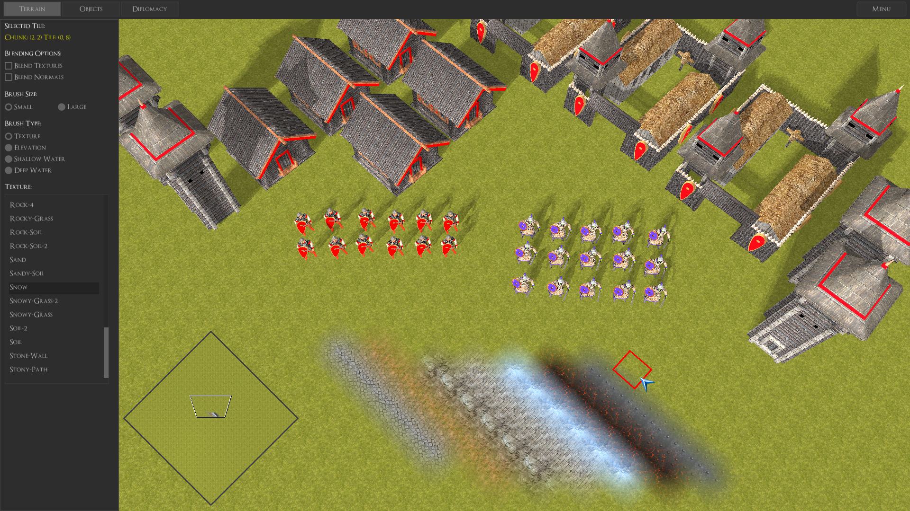
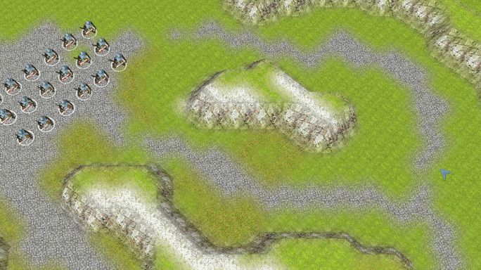

##  ##

Permafrost Engine is an OpenGL 3.3 Real Time Strategy game engine written in C. 
It is made in the image of old classics, but incorporating some modern ideas.

## Engine Showcase ##

EVERGLORY is the flagship game developed using Permafrost Engine. 

[Support the project - Wishlist on Steam today!](https://store.steampowered.com/app/1309720/EVERGLORY/)

## Engine Summary ##

* OpenGL 3.3 programmable pipeline (more modern extensions used where available)
* Custom ASCII model format with Blender export script
* Skeletal animation with GPU skinning
* Phong reflection model with materials
* Directional light shadow mapping
* Batched rendering with dynamic batches
* Ringbuffer-based streaming of data to GPU
* RTS camera, FPS camera
* Rendering of tile-based map parsed from ASCII file
* Water rendering (including reflection, refraction, soft edge effects)
* Export/Import of game entites to/from ASCII files
* Engine internals exposed to Python 2.7 for scripting
* Event system
* UI framework (Nuklear-based)
* Efficient raycasting
* Map/Scene editor
* Pause/Resume system
* Fast rendering of huge maps
* Map navigation graph/grid generation
* Implementation of 'boids' steering/flocking behaviours
* Hierarchial flow field pathfinding
* Handling of dynamic obstacles in pathfinding
* Dynamic collision avoidance of multiple entities using Hybrid Reciprocal Velocity Obstacles and the ClearPath algorithm
* Efficient spatial indexing using a quadtree
* RTS minimap
* RTS-style unit selection
* RTS unit combat system
* RTS fog-of-war system
* Support for different resolutions and aspect ratios
* Configurable graphics settings
* Serialization and deserialization of the entire Python interpreter state
* Saving and restoring of any engine session, including all Python-defined state
* Multithreaded: simulation and rendering in a 2-stage pipeline
* Advanced debug visualizations and profiling instrumentatation
* Fiber system for putting work in lightweight tasks that are scheduled in userspace
* Cross-platform (Linux and Windows)

## Dependencies ##

* SDL2 2.0.10
* GLEW 2.1.0
* python 2.7.17
* stb_image.h, stb_image_resize.h
* khash.h
* nuklear.h

All dependencies can be built from source and distributed along with the game binary if desired. 
Python is built with a subset of the default modules and packaged with a trimmed-down stdlib.

## Building Permafrost Engine ##

#### For Linux ####

1. `git clone https://github.com/eduard-permyakov/permafrost-engine.git`
2. `cd permafrost-engine`
3. `make deps` (to build the shared library dependencies to `./lib`)
4. `make pf`

Now you can invoke `make run` to launch the demo or `make run_editor` to launch the map editor.
Optionally, invoke `make launchers` to create the `./demo` and `./editor` binaries which don't 
require any arguments.

#### For Windows ####

The source code can be built using the mingw-w64 cross-compilation toolchain 
(http://mingw-w64.org/doku.php) using largely the same steps as for Linux. Passing `PLAT=WINDOWS` 
to the make environment is the only required change.

The compliation can either be done on a Linux host, or natively on Windows using MSYS2 (https://www.msys2.org/).

1. `git clone https://github.com/eduard-permyakov/permafrost-engine.git`
2. `cd permafrost-engine`
3. `make deps PLAT=WINDOWS`
4. `make pf PLAT=WINDOWS`
5. `make launchers PLAT=WINDOWS`

## License ##

Permafrost Engine is licensed under the GPLv3, with a special linking exception.

## Devlog ##

Follow the development of Permafrost Engine and EVERGLORY on YouTube: [Channel Link](https://www.youtube.com/channel/UCNklkpsPnNpRhC9oVkpIpLA)

[Indie RTS Devlog #1: Introducing Permafrost Engine](https://youtu.be/0dEttWferm8)

[Indie RTS Devlog #2: Saving The Python Interpreter](https://youtu.be/ch-zjn05gxQ)

[Indie RTS Devlog #3: Group Pathfinding](https://youtu.be/ALL7AQ1MRas)

[EVERGLORY: Teaser Trailer #1](https://youtu.be/yTJ7wTJy7jc)

[Indie RTS Devlog #4: Fog of War](https://youtu.be/2rXElWzAGrY)

[Indie RTS Devlog #5: Performance Optimization](https://www.youtube.com/watch?v=HV_CLHkpXpY)

## Comments/Questions ##

Comments or questions regarding the project or the source code? E-mail: edward.permyakov@gmail.com.
Discuss EVERGLORY and its' development on Discord here: https://discord.gg/jSQ8M6C. Pull requests
are not accepted until the release of EVERGLORY, which will coincide with the 1.0 milestone of the 
engine.

