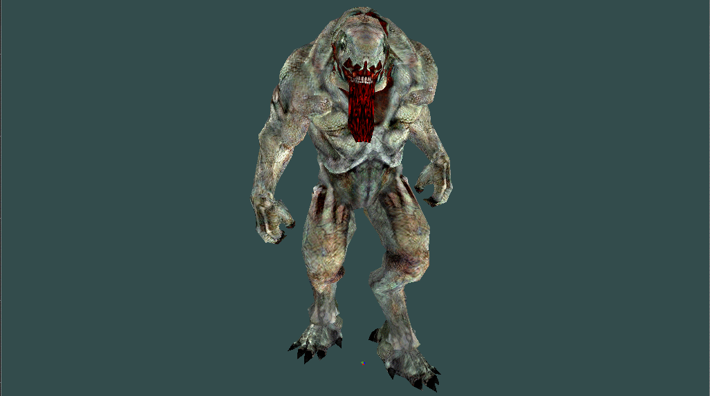
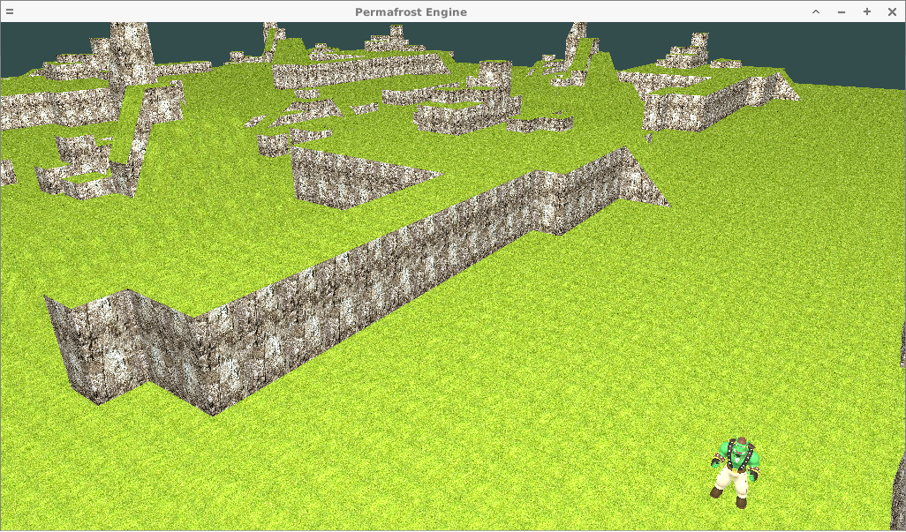
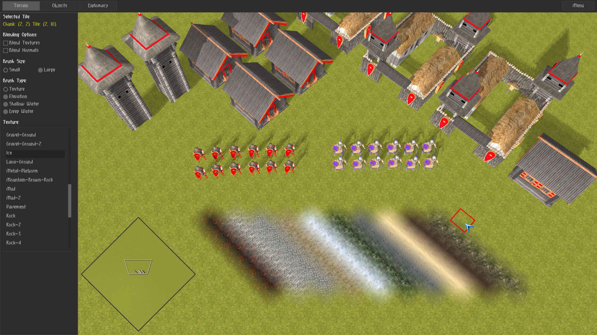
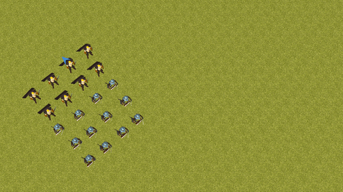

##  ##

Permafrost Engine is an OpenGL 3.3 Real Time Strategy game engine written in C. 
It is made in the image of old classics, but incorporating some modern ideas.

## Engine Showcase ##

###### Hellknight from DOOM 3 by id Sofware ######

###### Sinbad by Zi Ye ######

###### Tile-Based Map ######

###### Map Editor ######

###### Baked Navigation Grid ######

###### Unit Selection + Flocking ######

###### Flow Field Pathfinding ######

## Engine Summary ##

* OpenGL 3.3 programmable pipeline
* Custom ASCII model format with Blender export script
* Skeletal animation with GPU skinning
* Phong reflection model with materials
* Directional light shadow mapping
* RTS camera, FPS camera
* Rendering of tile-based world parsed from ASCII file
* Export/Import of game entites to/from ASCII files
* Engine internals exposed to Python 2.7 for scripting
* Event system
* UI framework (Nuklear-based)
* Efficient raycasting
* Map/Scene editor
* Fast rendering of huge maps (map size only limited by memory)
* Map navigation graph/grid generation
* Implementation of 'boids' steering/flocking behaviours
* Hierarchial flow field pathfinding
* RTS minimap
* RTS-style unit selection
* RTS unit combat system
* Cross-platform (Linux and Windows)

## Dependencies ##

* SDL2 2.0.7
* GLEW 2.1.0
* python 2.7.13
* stb_image.h, stb_image_resize.h
* khash.h, kvec.h
* nuklear.h

All dependencies can be built from source and distributed
along with the game binary if desired. 

## Building Permafrost Engine ##

#### On Linux ####

1. `git clone https://github.com/eduard-permyakov/permafrost-engine.git`
2. `cd permafrost-engine`
3. `make deps` to build the shared library dependencies to `./lib`
4. `make pf`
5. `make run` to run the demo or `make run_editor` to run the map editor

#### On Windows ####

1. Python must be compiled using MSVC build tools and the solution file found in the
   the source's `PCbuild` directory. Afterwards, copy `python27.dll`(and extension shared
   libraries if you wish) and the `Lib` folder to `./lib`. Alternatively, you may try 
   to link against an existing Python installation elsewhere on your system.
2. The rest of the source code can be built with MinGW and MSYS using largely the same steps
   as on Linux.
3. `run.bat` or `run_editor.bat` will launch the binary with appropriate arguments.

## License ##

Permafrost Engine is licensed under the GPLv3, with a special linking exception.

## Contributing ##

Wishing to contribute to the development of the project or simply wanting to make a question
or comment regarding the source code? E-mail: edward.permyakov@gmail.com

